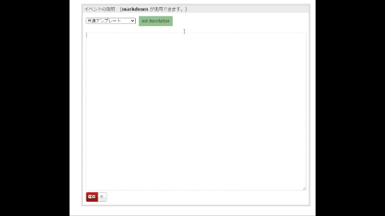

# Event Descriptor

connpass イベント説明欄のテンプレート入力ツール

## 使い方

1. このリポジトリをclone
1. chromeを開き、設定から拡張機能画面に移動する
1. 「パッケージ化されていない拡張機能を読み込む」からcloneしたリポジトリをそのまま読み込ませる

## テンプレート読み込み元

使用可能なテンプレートは別リポジトリで管理している

github: https://github.com/tessai9/event-description-template
